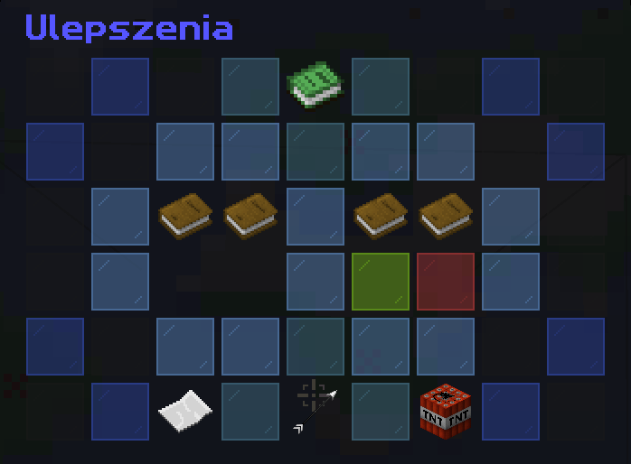
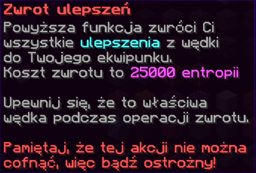

# Informacje Początkowe 📖

## Czym są Ulepszenia?

Ulepszenia to w zasadzie niestandardowe zaklęcia tworzone przy użyciu kotła. Można je obecnie zastosować TYLKO na wędce.

## Jak stworzyć ulepszenia?

Ulepszenia można wytworzyć, wrzucając wymagane przedmioty do kotła i uderzając go wędką. 

Bardziej szczegółowy przewodnik na temat wytwarzania ulepszeń znajdziesz [tutaj](wiki)

## Jak umieścić ulepszenia na wędce?

Zakładanie ulepszeń wędkarskich na wędke jest bardzo proste. Wtkonaj te proste kroki:
1. Owórz menu `/fish augment` lub `/fish menu` -> Ulepszenia
2. Przeciągnij i upuść wędkę oraz ulepszenia w puste miejsca pod książkami. Twoja wędka powinna znajdować się w pierwszym miejscu, a ulepszenie w drugim.
3. Kliknij na zieloną szybkę aby zaakceptować ulepszenie

## Jak usunąć ulepszenia?

Usuwanie ulepszeń jest również niezwykle proste! Jednak do tego będziesz potrzebować 25 000 Entropi.

Aby usunąć swoje ulepszenia, wykonaj następujące proste kroki:
1. Otwórz menu `/fish augment` lub `/fish menu` -> Ulepszenia
2. Umieść wędkę w pierwszym miejscu menu pod książką.
3. Kliknij TNT, aby potwierdzić usunięcie swoich ulepszeń.
4. Ulepszenia zostaną zwrócone do Twojego ekwipunku.(spadną na ziemię, jeśli nie masz miejsca).

