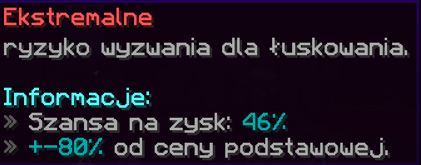

# Łuskowanie ⚖

## Do czego służy Łuskowanie?
Rybie łuski służą do wypróbowania szczęścia w zarabianiu więcej lub mniej pieniędzy. Aby skorzystać z funkcji skalowania, wykonaj poniższe czynności:

1. Otwórz menu łuskowania za pomocą `/fish Scales` lub poprzez menu główne. 

2. Przeciągnij i upuść rybę do GUI. Można wykorzystać dowolne sloty.

3. Wybierz typ skali: Niski, Średni, Wysoki lub Ekstremalny

4. Naciśnij kowadło, aby skalować rybę.

Kiedy już skalujesz swoją rybę, zyska ona losową „wagę”. Jest to bezpośrednio powiązane z uzyskanym wzrostem lub obniżką ceny. Wzrost/spadek jest ZAWSZE procentem opartym na normalnej cenie sprzedaży ryb.

## FAQ

### Co się stanie, jeśli ułoże ryby w jeden stos?
Wagi działają w specyficzny sposób. Jeśli umieścisz ryby w jednym miejscu w menu, cały stos zostanie przeskalowany za tę samą cenę.

Jednakże jeśli podzielisz je na różne przedziały, wszystkie otrzymają losową skalowaną cenę. Możesz zaryzykować cały stos lub poszczególne, w zależności od tego, jak się czujesz.