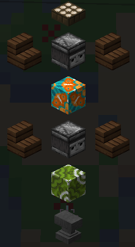

# Totemy Wędkarskie

## Jak zdobyć totem wędkarski?

Zdobycie totemu wędkarskiego jest łatwe. Musisz zbudować totem i zapewnić określoną liczbę materiałów.

### Jakich przedmiotów potrzebuję?

* 16 [Ogonów Delfina](wiki)
* 16 [Pazur Kraba](wiki)
* 16 [Łuska Kraba](wiki)
* 16 [Macka kałamarnicy](wiki)
* 6 Obojętnie jaka Platynowa ryba

:::danger
Aby aktywować Totem, będziesz potrzebować 20 poziomu wędkarstwa. Możesz to sprawdzić w `/fish stats`
:::

## Jak aktywować totem wędkarski?

Gdy już będziesz mieć powyższe elementy i wymagany poziom. Musisz zbudować strukturę. Przewodnik znajdziesz w `/fish menu` lub użyj poniższego obrazka.

Kiedy już zbudujesz totem wędkarski, użyj wędki, uderz w dolnego obserwera, a powinien się on aktywować lub wyświetli komunikat o błędzie, w zależności od tego, czego brakuje.

:::info
Kierunek schodów nie ma znaczenia i mogą być zwrócone w dowolnym kierunku.
:::

## Aktywowałem mój totem, więc co on robi?

Totem zapewnia użytkownikowi wiele różnych korzyści. Jednak niektóre z nich wymagają ulepszenia Entropii, a inne wymagają wysokiego poziomu połowu. Podzieliłem je na trzy sekcje:

## Ulepszenia totemu

Totem wędkarski ma trzy główne ulepszenia. Są one wymienione poniżej. (Koszt ulepszenia to poprzedni koszt + ustalona kwota) Kolumna maksymalna jest tym, czego możesz się spodziewać, jeśli awansujesz ulepszenie do maksymalnego poziomu.

| Ulepszenia      | Koszt początkowy | Dodatkowy koszt | Maksymalne ulepszenie | Co to robi? 
| --------------- | ---------------- | --------------- | --------------------- | ----------- 
| Zasięg          | 115,000          | 62,500          | 30 bloków             | Zwiększa to promień, w którym możesz stać wewnątrz, aby uzyskać wzmocnienia.
| Czas odnowienia | 120,000          | 100,000         | 30 minut              | Skraca to początkowy czas odnowienia z 60 minut.
| Aktywny czas    | 90,000           | 100,000         | 30 minut              | Wydłuża to czas działania wzmocnień totemu.

Możesz skorzystać z poniższego wzoru, aby obliczyć koszt kolejnego uaktualnienia. Dodam przykład, powiedzmy ulepszanie zasięgu do poziomu 5.

150 000 + (75 000 * 5) = 525 000 Entropii na 5. poziomie. 

Koszt początkowy + (dodatkowy poziom ∗ kosztu)

:::info
Zaleca się zwiększanie promienia tylko wtedy, gdy chcesz, aby obejmował on duży obszar, np. jezioro. Wystarczy w nim stanąć, aby otrzymać pasywne wzmocnienia. Spławik wędkarski nie musi się w nim znajdować.
:::

## Pasywne Sloty

