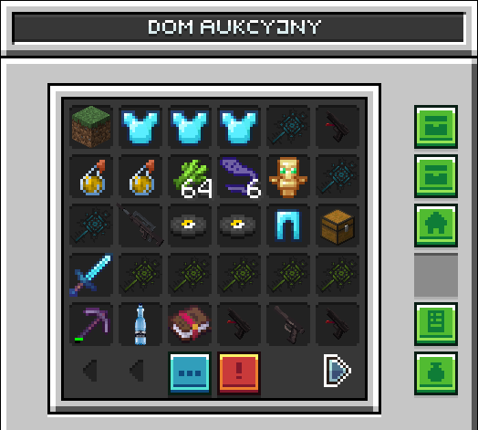

# Dom Aukcyjny

### Jak sprzedawać w Domu Aukcyjnym?

Weź do łapki przedmiot który chcesz sprzedać wpisz na chacie `/ah sell <cena>` aby wystawić przedmiot na AH.

Chcesz sprzedać Kilka Przedmiotów jako zestaw? Wpisz `/ah sellinventory <cena>` następnie otworzy ci się GUI do którego wkładasz przedmioty następnie potwierdzasz klikając zielone.

### Jak kupować na Domu Aukcyjnym?

Aby zakupić przedmiot na Domu Aukcyjnym wystarczy go otworzyć `/ah` i wybrać przedmiot który ciebie interesuje i nacisnąć na niego LPM i potwierdzić zielonym, zakupiony przedmiot będzie dostępny w zakładce "Kupione Przedmioty"

